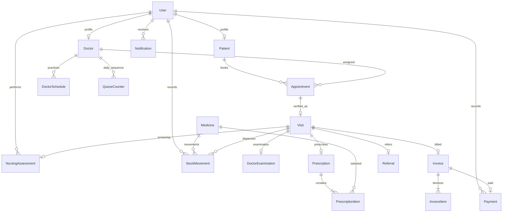
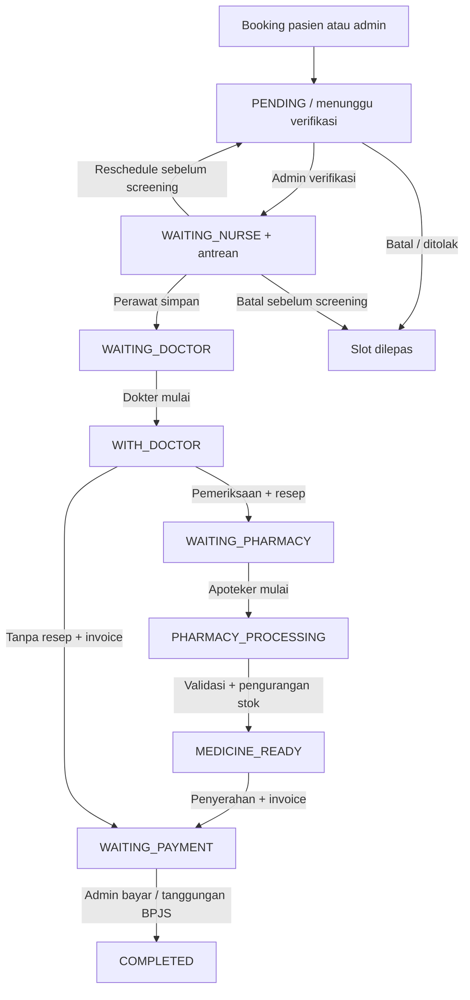

# Medika Husada — Klinik Pratama SIM

Aplikasi web klinik multi-user dengan backend Python, database persisten, dan alur pelayanan lintas pasien, admin, perawat, dokter, serta apoteker. Admin juga menjalankan fungsi kasir. Proyek ini ditujukan untuk pengoperasian dan demonstrasi di localhost.

## Referensi visual

Referensi yang tersedia adalah **`apalah.html`**, sesuai klarifikasi pengguna. File tersebut berisi spesifikasi desain *Clinical Clarity*, bukan prototype HTML dengan halaman interaktif. Implementasi mengikuti warna teal `#00685f`, latar `#f8f9ff`, Plus Jakarta Sans, navigasi putih, kartu dengan border tipis, badge status, tipografi, dan responsivitas yang dijelaskan di sana. File referensi tetap dipertahankan. `begitulah.py` adalah eksperimen lama dan tidak digunakan oleh aplikasi baru.

Tidak ada database utama di JavaScript/localStorage. Booking, status kunjungan, resep, stok, invoice, dan notifikasi berasal dari SQLAlchemy/SQLite. JavaScript menangani modal, polling, slot lookup, toast, konfirmasi, serta UX form.

## Mulai cepat — Windows PowerShell

Memerlukan Python 3.11+.

```powershell
cd D:\projek
python -m venv .venv
.\.venv\Scripts\python -m pip install -r requirements.txt
.\.venv\Scripts\python seed.py
.\.venv\Scripts\python app.py
```

Buka **http://127.0.0.1:5000**. Menggunakan executable virtualenv langsung tidak membutuhkan perubahan PowerShell execution policy.

Alternatif setelah mengaktifkan environment:

```powershell
.\.venv\Scripts\Activate.ps1
pip install -r requirements.txt
python seed.py
python app.py
```

`create_app()` membuat tabel bila belum ada. `seed.py` mengisi data demo secara idempotent: akun yang sudah ada dan transaksi yang telah dibuat tidak ditimpa. Tidak perlu Node.js, npm, Redis, Docker, atau server database terpisah.

## Akun demo

| Peran | Email | Password |
|---|---|---|
| Admin / kasir | admin@medikahusada.local | `Admin123!` |
| Perawat | perawat@medikahusada.local | `Perawat123!` |
| Apoteker | apoteker@medikahusada.local | `Apoteker123!` |
| Dokter umum | fakih@medikahusada.local | `Dokter123!` |
| Dokter kandungan | alia@medikahusada.local | `Dokter123!` |
| Pasien umum | pasien@medikahusada.local | `Pasien123!` |
| Pasien BPJS | ratna@medikahusada.local | `Pasien123!` |
| Pasien tambahan | siti@medikahusada.local | `Pasien123!` |

Dokter default: **dr. Muhammad Fakih Nabal** dan **dr. Alia Fransiska Dewi Arum Trilestari**. Seed menyediakan jadwal Senin–Sabtu, sepuluh obat, tiga pasien, janji pada slot mendatang, dan satu kunjungan historis lengkap dengan resep serta struk. Data dan tarif demo bukan anjuran klinis atau tarif resmi.

## Fitur

- Landing page publik dengan layanan, dokter, jadwal mingguan, ketersediaan slot hari ini, dan CTA booking.
- Register pasien, NIK/email unik, nomor RM otomatis, hash password, login/logout, show/hide password, dan profil kesehatan.
- Booking melalui slot database, pencegahan tanggal/jam lewat, bentrok slot, reschedule, pembatalan, serta pelepasan slot secara transaksional.
- Admin mendaftarkan pasien, mencari nama/NIK/RM/telepon, memfilter tanggal/status janji, pagination, verifikasi, penolakan, dan pendaftaran kunjungan pasien lama.
- Antrean per dokter/hari, panggil, lewati, dan kembalikan antrean.
- Pemeriksaan perawat: tekanan darah, suhu, berat, tinggi, nadi, respirasi, SpO2, skala nyeri, keluhan, catatan, dan BMI otomatis.
- Pemeriksaan dokter: anamnesis, fisik, assessment, diagnosis utama/tambahan, ICD-10, tindakan/biaya, catatan internal, rekomendasi, follow-up, dan hasil lab berupa teks.
- Resep banyak obat: jumlah, dosis, frekuensi, durasi, waktu, instruksi. Harga obat disalin ke item resep.
- Farmasi: mulai racik, lapor stok kurang, obat siap, penyerahan; stok dan pergerakannya tersimpan secara atomik.
- Manajemen obat, harga/satuan/kategori, stok masuk/penyesuaian, batas stok minimum, dan tanggal kedaluwarsa.
- Invoice otomatis dari konsultasi, tindakan, resep; diskon; pencatatan Tunai/Transfer/QRIS/Debit; BPJS menghasilkan tagihan pasien Rp0 dengan rincian biaya tetap lengkap.
- Receipt tersedia untuk admin dan pemilik data pasien, modal struk, serta cetak/Simpan PDF melalui dialog print browser.
- Portal rekam medis pasien, riwayat dokter yang ditangani, surat rujukan digital yang dapat dicetak, serta cetak resep.
- Dashboard berbasis database; polling lima detik, timeline pasien, toast, daftar notifikasi, unread counter, mark as read.
- Pengingat H-1 / tiga jam sebelum janji, dibuat saat pasien membuka aplikasi/polling; deduplikasi per slot dan jendela waktu.
- Laporan periode tanggal, pendapatan pasien, cakupan BPJS, biaya bruto per kategori, daftar transaksi, dan export CSV.
- Admin menambah/mengedit dokter, jadwal, interval, kuota, status aktif, serta akun petugas dan password/aktivasi pengguna.

## Struktur proyek

```text
app.py                       # Entry point localhost
seed.py                      # Seed idempotent
requirements.txt             # Dependensi runtime + pytest
requirements-dev.txt         # Tambahan Playwright untuk verifikasi browser
.env.example
clinic/
  __init__.py                # App factory, extensions, SQLite setup, session config
  models.py                  # Model relasional dan enum status
  services.py                # Booking, workflow, stok, billing, notification, profil
  routes.py                  # HTTP, RBAC, object authorization, laporan
  templates/                 # Jinja: landing/auth/5 role/kunjungan/struk/dll.
  static/css/app.css         # Design system + responsive + print
  static/js/app.js           # UX, polling, dialog, fetch, slot lookup
  static/favicon.svg         # Identitas klinik buatan sendiri
tests/
  conftest.py                # Database temporer terisolasi
  test_workflow.py           # Workflow, keamanan, validasi dan konfigurasi
scripts/
  browser_check.py           # Login 5 role + viewport + modal + slot
  browser_workflow.py        # Workflow nyata 5 konteks browser / DB terpisah
docs/screenshots/            # Screenshot aktual hasil uji browser
instance/                    # Dibuat otomatis, tidak masuk Git
  medika.db                  # Database aplikasi
  .secret                    # Secret lokal persisten bila .env tidak mengaturnya
apalah.html                  # Referensi desain pengguna, tidak dieksekusi
begitulah.py                 # File lama pengguna, tidak dieksekusi
```

## Teknologi dan arsitektur

Python 3.11, Flask, Jinja2, Flask-SQLAlchemy/SQLAlchemy, SQLite, Flask-Login, Flask-WTF CSRF, Werkzeug hashing, python-dotenv, CSS custom, dan JavaScript vanilla. SQLite menggunakan foreign keys, WAL, serta busy timeout. Rupiah disimpan sebagai integer agar tidak ada kesalahan pembulatan floating point.

Routes memeriksa identitas/peran dan kepemilikan objek, memanggil domain service, lalu commit satu transaksi. Kegagalan validasi, constraint, atau konflik write menyebabkan rollback. Conditional update pada status mencegah tindakan workflow yang berulang/berurutan salah; unique constraint mengunci slot, relasi pemeriksaan, invoice, dan payment. Pengurangan stok menggunakan SQL update dengan syarat stok akhir tidak negatif.

Satu `Appointment` menyimpan relasi pasien/dokter; satu `Visit` mengacu ke appointment itu. Identitas tidak diduplikasi pada tiap tabel pemeriksaan. Diagnosis dan hasil laboratorium sederhana disimpan pada `DoctorExamination`; sistem ini belum memiliki subsistem order laboratorium terpisah.

## ERD



## Alur penggunaan

1. Login pasien, lengkapi profil, lalu **Buat Janji Temu**. Pilih dokter, tanggal, slot, keluhan, dan pembiayaan. Untuk mencoba BPJS gunakan Ratna atau lengkapi nomor BPJS 13 digit pada profil.
2. Login admin pada browser/profil terpisah. Janji baru muncul otomatis di dashboard. Klik **Verifikasi**, lalu konfirmasi: visit dan nomor antrean dibuat, notifikasi dikirim.
3. Login perawat. Buka pasien, masukkan tanda vital, klik **Simpan & kirim ke dokter**.
4. Login dokter yang dipilih saat booking. Buka pasien, **Mulai pemeriksaan**, lengkapi pemeriksaan, tambahkan obat bila diperlukan, lalu **Selesaikan pemeriksaan**. Rujukan dapat diterbitkan setelah pemeriksaan dan sebelum kunjungan selesai.
5. Login apoteker. Buka resep, **Mulai racik**, **Obat siap** (stok dikurangi), lalu **Serahkan ke kasir/admin** (invoice otomatis dibuat).
6. Login admin, buka kunjungan, periksa invoice, masukkan diskon bila perlu, pilih metode, lalu konfirmasi pembayaran. BPJS hanya menampilkan tombol **Konfirmasi ditanggung BPJS**.
7. Dashboard pasien memperbarui status menjadi selesai. Pasien dapat melihat ringkasan, aturan pakai obat, rujukan, dan struk sendiri.

Gunakan profil browser berbeda atau beberapa browser untuk sesi yang benar-benar terpisah. Tab biasa dalam profil yang sama berbagi login cookie. Pemeriksaan klinis tidak dapat dimulai sebelum tanggal janji; untuk demo workflow langsung pilih tanggal hari ini. Verifikasi admin boleh dilakukan sebelumnya.



Reschedule/pembatalan diperbolehkan sebelum pemeriksaan perawat tersimpan. Reschedule pada janji terverifikasi mengembalikan visit ke `WAITING_VERIFICATION`, melepaskan slot lama, dan mewajibkan verifikasi ulang. Nomor antrean baru dialokasikan setelah verifikasi; nomor lama tidak dipakai ulang. Reschedule setelah pemeriksaan ditolak oleh backend. Mengubah jadwal praktik tidak otomatis mengubah janji pasien yang sudah tersimpan.

## Hak akses

| Peran | Akses |
|---|---|
| Pasien | Profil, janji, riwayat, resep, rujukan, invoice dan notifikasi miliknya sendiri |
| Admin | Operasional pasien, jadwal, antrean, pengguna, inventori, pembayaran, laporan dan rujukan; catatan dokter internal tidak ditampilkan |
| Perawat | Antrean pemeriksaan awal dan screening yang dibuatnya; tidak memperoleh catatan/resep dokter atau keuangan |
| Dokter | Kunjungan dan riwayat yang ditugaskan kepada dokter tersebut; pemeriksaan, resep dan rujukan |
| Apoteker | Identitas yang diperlukan, alergi, diagnosis singkat, resep, aturan pakai dan persediaan; tanpa riwayat klinis lengkap atau keuangan |

Dokter A tidak dapat mengakses kunjungan dokter B meskipun pasiennya sama. Pengubahan ID pada URL rekam medis, invoice, resep, atau rujukan tidak melewati pengecekan kepemilikan. Akun dinonaktifkan ditolak pada login berikutnya dan pada request sesi aktif berikutnya.

## Empat pilar OOP

| Pilar | Lokasi implementasi | Penggunaan nyata |
|---|---|---|
| Abstraction | `clinic/services.py`, `PaymentProcessor(ABC)` | Kontrak abstrak `amounts(total)` untuk strategi pembiayaan |
| Inheritance | `GeneralPayment(PaymentProcessor)`, `BPJSPayment(PaymentProcessor)` | Kedua strategi mewarisi interface pembayaran; `User(UserMixin, db.Model)` dan semua model juga menggunakan inheritance ORM |
| Polymorphism | `BillingService.invoice()` dan `.pay()` | Memanggil method `amounts()` yang sama pada processor umum/BPJS; hasil berbeda tanpa duplikasi alur invoice |
| Encapsulation | `User._password_hash`, `set_password()`, `check_password()`; `Medicine._stock`, property `stock`, `change_stock()` | Password hanya ditulis melalui hashing; operasi stok memvalidasi jumlah dan mencatat `StockMovement` dalam transaksi |

Service layer juga mengenkapsulasi perubahan domain: `AppointmentService`, `WorkflowService`, `PharmacyService`, `BillingService`, `PatientService`, dan `NotificationService`. Frontend tidak dapat menentukan status final, harga obat, total invoice, nomor antrean, atau kepemilikan rekam medis.

## Testing

```powershell
.\.venv\Scripts\python -m pytest -q -W error
```

Tes memakai database SQLite temporer per kasus, bukan `instance/medika.db`. Cakupan: login semua role, render halaman, registrasi/hash password, CSRF, RBAC, akses rekam medis/struk pasien lain, dokter tidak terkait, bentrok slot, reschedule/cancel, verifikasi berulang, antrean, urutan workflow, notifikasi/reminder, stok kurang, rollback banyak obat, invoice umum/BPJS, pembayaran berulang, kunjungan tanpa resep, serta konfigurasi admin.

Verifikasi browser opsional:

```powershell
.\.venv\Scripts\python -m pip install -r requirements-dev.txt
# Jika Microsoft Edge tidak tersedia di lokasi default Windows:
.\.venv\Scripts\python -m playwright install chromium

# Server python app.py harus sudah berjalan di terminal lain:
.\.venv\Scripts\python scripts/browser_check.py

# Menjalankan server sendiri pada port 5001 dan database temporer:
.\.venv\Scripts\python scripts/browser_workflow.py
```

`browser_check.py` memeriksa login lima peran, modal receipt, slot booking, menu mobile, tidak ada JavaScript error, dan tidak ada horizontal overflow pada 375/768/1366/1920px. Script ini membaca data demo; menjalankannya setelah mengubah semua data demo mungkin membutuhkan penyesuaian asumsi kunjungan contoh.

`browser_workflow.py` melakukan booking → verifikasi → perawat → dokter dengan dua obat → farmasi → pembayaran melalui UI pada lima browser context. Ia mengecek polling lintas sesi serta jumlah payment/stok akhir di database. Jadwal test sengaja dibuka sepanjang hari pada database temporer agar tidak bergantung pada jadwal klinik demo.

## Screenshot aktual

Screenshot dihasilkan dari aplikasi yang berjalan, bukan mockup:

- [Landing desktop](docs/screenshots/landing-1366.png)
- [Landing mobile 375px](docs/screenshots/landing-375.png)
- [Dashboard admin](docs/screenshots/admin-1366.png)
- [Dashboard admin mobile](docs/screenshots/admin-375.png)
- [Dashboard pasien](docs/screenshots/patient-dashboard.png)
- [Antrean pasien setelah obat siap](docs/screenshots/patient-queue.png)
- [Pemeriksaan perawat](docs/screenshots/nurse-examination.png)
- [Pemeriksaan dokter + resep](docs/screenshots/doctor-examination.png)
- [Resep apoteker](docs/screenshots/pharmacist-prescription.png)
- [Struk pembayaran](docs/screenshots/receipt.png)

## Konfigurasi, penyimpanan, dan reset

Salin `.env.example` ke `.env` bila membutuhkan konfigurasi eksplisit. Isi `SECRET_KEY` dengan nilai acak, misalnya hasil `python -c "import secrets; print(secrets.token_hex(32))"`. Tanpa `.env`, aplikasi membuat secret lokal sekali di `instance/.secret` sehingga restart tidak mengganti secret sesi. `.env`, database, secret, dan virtualenv diabaikan Git.

Default `DATABASE_URL=sqlite:///medika.db` mengacu ke **folder instance Flask**. Tanggal/waktu aplikasi mengikuti waktu lokal sistem; untuk penggunaan Indonesia atur OS ke zona waktu klinik.

Reset hanya jika memang ingin menghapus seluruh data lokal. Matikan server terlebih dahulu, lalu dari folder proyek:

```powershell
Copy-Item -LiteralPath .\instance\medika.db -Destination .\instance\medika.backup.db
Remove-Item -LiteralPath .\instance\medika.db
Remove-Item -LiteralPath .\instance\medika.db-wal,.\instance\medika.db-shm -ErrorAction SilentlyContinue
.\.venv\Scripts\python seed.py
```

Jangan menjalankan `begitulah.py` untuk menyalakan aplikasi baru. Entry point yang digunakan adalah `app.py`.

## Security dan batas implementasi

Password menggunakan Werkzeug hashing. Mutasi POST dilindungi CSRF termasuk fetch. Semua routes privat memerlukan login; otorisasi peran dan objek dilakukan di backend. Template melakukan escaping, notifikasi JS menggunakan `textContent`, cookie HTTPOnly/SameSite, respons data privat `no-store`, SQL ORM terparameterisasi, serta halaman error tidak mengekspos detail SQL.

Kode ini fungsional untuk localhost dan tugas/demo, tetapi belum merupakan sistem produksi yang telah diaudit untuk data kesehatan. Batas yang perlu diketahui:

- BPJS adalah pencatatan tanggungan lokal berdasarkan profil; belum terhubung ke layanan validasi/klaim BPJS.
- Tunai/Transfer/QRIS/Debit merupakan pencatatan pembayaran oleh admin; belum ada payment gateway atau rekonsiliasi bank otomatis.
- Reminder bersifat in-app saat sesi aktif; belum ada background scheduler, email, SMS, atau WhatsApp. Provider dapat dipanggil dari `NotificationService` setelah integrasi dan konfigurasi ditambahkan.
- PDF menggunakan Print → Save as PDF dari browser; rujukan tidak memiliki tanda tangan elektronik tersertifikasi.
- Hasil lab berupa teks. Belum ada upload hasil, order lab, pencatatan batch obat, atau rekonsiliasi stok lintas gudang.
- Diagnosis tambahan dan tindakan berupa teks, belum katalog ICD/tindakan terpisah. Jadwal per dokter menyediakan satu rentang praktik per hari dalam seminggu; setiap slot menampung satu pasien.
- Dashboard menampilkan maksimal 30 kunjungan/appointment terakhir/aktif; daftar janji dan pasien mendukung pagination. Laporan adalah laporan kas pasien dan cakupan biaya BPJS, bukan buku besar akuntansi.
- CSS mengambil font Google dengan fallback font sistem. Fitur aplikasi tetap berjalan bila font eksternal tidak tersedia.
- Belum ada password reset lewat email, MFA, rate limiting login, enkripsi database at rest, audit trail menyeluruh, atau migration history. Status dan stok memiliki constraint/transaksi; perubahan skema lanjutan perlu migration yang terencana.

## Menjalankan di server nanti

Gunakan WSGI server, misalnya Waitress di Windows (`waitress-serve --listen=127.0.0.1:5000 app:app` setelah memasang Waitress), reverse proxy HTTPS, secret kuat, dan cookie `SESSION_COOKIE_SECURE=True`. Jangan menggunakan development server Flask sebagai server publik. Pisahkan akun demo dari akun operasional, atur backup dan pemulihan, tambahkan migration serta kontrol keamanan yang diperlukan. SQLite cocok untuk beban lokal; layanan booking/counter menggunakan SQLite upsert sehingga perpindahan ke PostgreSQL memerlukan penyesuaian statement dan pengujian konkurensi ulang.
